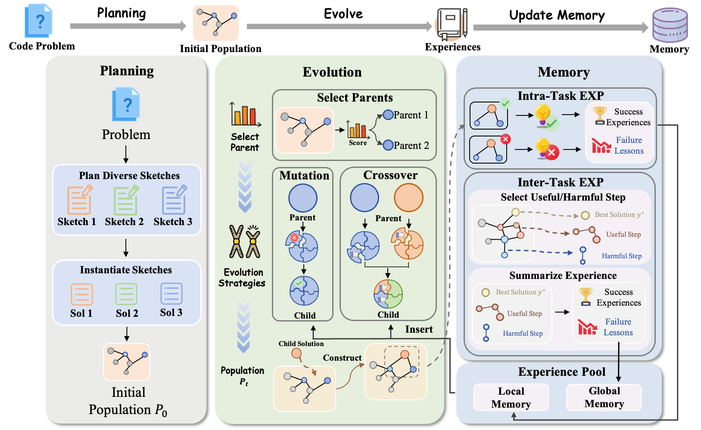
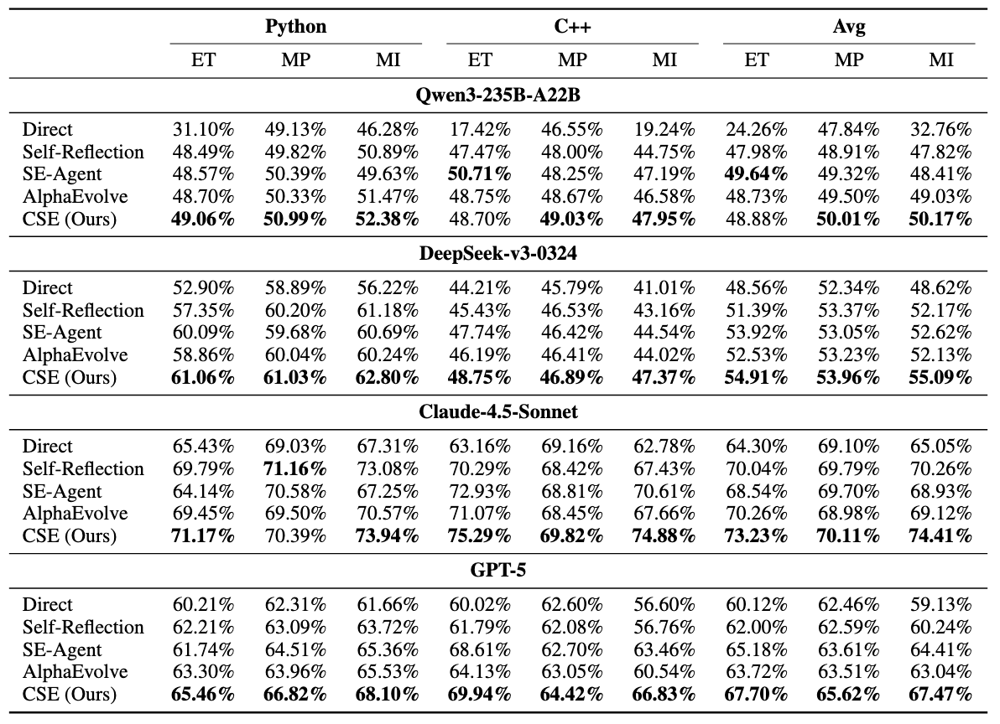
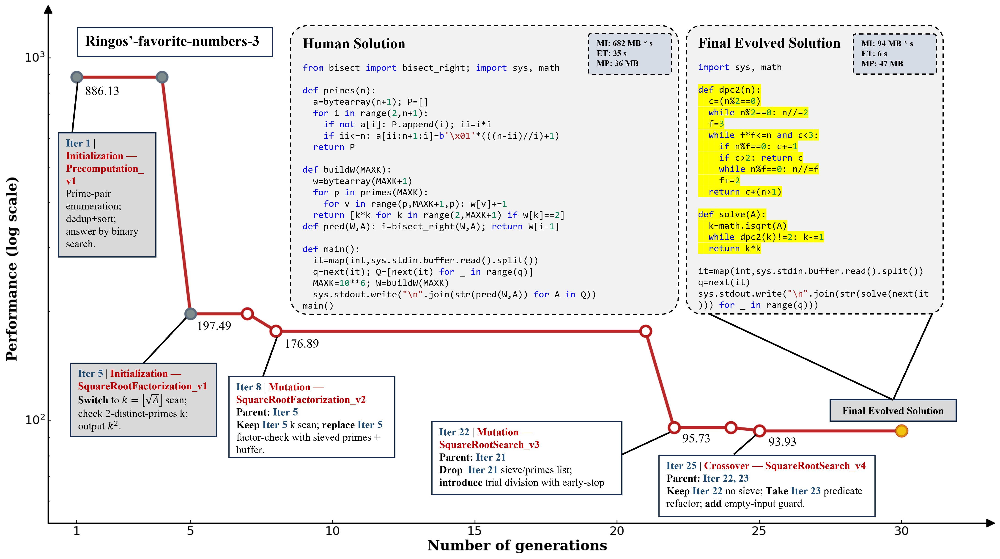

<div align="center">

# 🧬 EvoControl

<p align="center">
  <strong>🏆 Controlled Self-Evolution for Algorithmic Code Optimization </strong>
</p>

<p align="center">
  <a href="https://arxiv.org/abs/2601.07348"></a>
  <a href="https://github.com/EffiBench/EffiBench-X"></a>
  <a href="#"></a>
  <a href="#"></a>
</p>

<p align="center">
  <em>Achieving superior code complexity through diversified planning initialization, genetic evolution, and hierarchical experience memory</em>
</p>

</div>

---

## 🎯 What is CSE?

**Controlled Self-Evolution (CSE)** is a novel framework that dramatically improves exploration efficiency in code optimization. Unlike existing self-evolution methods that suffer from **initialization bias**, **uncontrolled stochastic operations**, and **insufficient experience utilization**, CSE addresses all three bottlenecks through:

<div align="center">

</div>

### 🔑 Three Key Innovations

| Component                                  | Problem Addressed                                      | Solution                                              |
| ------------------------------------------ | ------------------------------------------------------ | ----------------------------------------------------- |
| 🎨 **Diversified Planning Initialization** | Initialization bias trapping evolution in poor regions | Generate structurally distinct algorithmic strategies |
| 🧬 **Genetic Evolution**                   | Uncontrolled stochastic operations lacking feedback    | Feedback-guided mutation & compositional crossover    |
| 🧠 **Hierarchical Experience Memory**      | Insufficient experience utilization across tasks       | Local + Global memory for experience reuse            |

---

## 🔬 Method Overview

### 1. 🎨 Diversified Planning Initialization

Generates multiple **structurally distinct algorithmic strategies** before evolution begins, ensuring broad coverage of the solution space:

- **Multi-paradigm exploration**: DP, Greedy, Two Pointers, Bit Manipulation, etc.
- **Sketch instantiation**: Transform abstract strategies into concrete implementations
- **Initial population**: Create diverse starting points to avoid local optima

### 2. 🧬 Genetic Evolution

Replaces stochastic operations with **fine-grained feedback-guided mechanisms**:

#### 🔧 Controlled Mutation

- **Slot-based decomposition**: Decompose solutions into functional components
- **Targeted refinement**: Fix faulty components while preserving high-performing parts
- **Priority-guided**: Optimize bottlenecks, inherit good parts, inspect risky areas

#### 🤝 Compositional Crossover

- **Complementary combination**: Merge strengths from different solution trajectories
- **Structural integration**: Create cohesive hybrid implementations
- **Synergistic synthesis**: Achieve 1+1>2 effects through intelligent merging

### 3. 🧠 Hierarchical Evolution Memory

Captures and reuses evolutionary insights at **two levels**:

| Memory Type       | Scope      | Function                                                          |
| ----------------- | ---------- | ----------------------------------------------------------------- |
| **Local Memory**  | Intra-task | Accumulates task-specific lessons to avoid repeating failures     |
| **Global Memory** | Inter-task | Distills cross-task optimization patterns into reusable templates |

---

## 📊 Performance Results

### 🏆 Main Results on EffiBench-X

CSE **consistently outperforms all baselines** across diverse LLM backbones (Qwen3-235B-A22B, DeepSeek-v3-0324, Claude-4.5-Sonnet, GPT-5):

<div align="center">

</div>

> **Metrics**: ET (Execution Time efficiency), MP (Memory Peak efficiency), MI (Memory-time Integral - our primary metric balancing both runtime and memory)

### 📈 Evolution Progress Analysis

CSE achieves **higher efficiency from early generations** and maintains **continuous improvement** throughout evolution:

<div align="center">

</div>

**Key Observations:**

- 🚀 **Fast Start**: CSE outperforms baselines from the first generation
- 📈 **Sustained Growth**: Continuous improvement without plateauing
- 🎯 **Efficiency**: Achieves superior results with limited exploration budget

---

## 🔍 Case Study

Detailed evolution trajectory on a real optimization task, showing how CSE progressively discovers more efficient algorithms:

<div align="center">

</div>

**Evolution Highlights:**

- **Iter 1**: Initial solution with basic approach (886.13 MI)
- **Iter 5**: Strategy switch to square-root factorization (197.49 MI)
- **Iter 8**: Controlled mutation improves factor-checking (176.89 MI)
- **Iter 22**: Trial division with early-stop optimization
- **Iter 25**: Crossover combines best features → **Final: 93.93 MI** (7× improvement!)

---

## ⚡ Quick Start

Get CSE running in **3 steps**:

```bash
# 1. Clone and install
git clone https://github.com/your-repo/EvoControl.git
cd EvoControl
conda create -n cse python=3.12
conda activate cse
pip install -e .

# 2. Configure API credentials in configs/Plan-Weighted-Local-Global-30.yaml
# Set model.api_key, model.api_base, etc.

# 3. Run your first experiment
python SE_Perf/instance_runner.py \
    --config configs/Plan-Weighted-Local-Global-30.yaml \
    --max-parallel 10 \
    --mode execute
```

> 💡 **Prerequisites**: Ensure [EffiBench-X](https://github.com/effibench/effibench-x) backend is running for code evaluation

---

## 📦 Installation & Configuration

### Installation

```bash
# Create virtual environment
conda create -n cse python=3.12
conda activate cse

# Install dependencies
pip install -e .
```

### Configuration

CSE uses a **two-layer configuration** system:

| Config Type         | File                                         | Purpose                                   |
| ------------------- | -------------------------------------------- | ----------------------------------------- |
| **Base Config**     | `configs/perf_configs/config_integral.yaml`  | Model parameters, runtime limits, prompts |
| **Strategy Config** | `configs/Plan-Weighted-Local-Global-30.yaml` | Evolution strategy orchestration          |

**Required Settings** (in strategy config):

```yaml
model:
  name: "deepseek-chat" # LLM model name
  api_base: "https://api.deepseek.com/v1"
  api_key: "your-api-key" # 🔑 Required!

global_memory_bank:
  enabled: true
  embedding_model:
    api_base: "your-embedding-api-base"
    model: "embedding-model-name" # Embedding Model Name
    api_key: "your-embedding-key" # 🔑 Required!
```

- You can see https://platform.openai.com/docs/api-reference/embeddings for more details about embedding models.

---

## 💻 Usage Examples

### Basic Experiment

```bash
python SE_Perf/instance_runner.py \
    --config configs/Plan-Weighted-Local-Global-30.yaml \
    --max-parallel 10 \
    --mode execute
```

### Quick Test (First 5 Instances)

```bash
python SE_Perf/instance_runner.py \
    --config configs/Plan-Weighted-Local-Global-30.yaml \
    --max-parallel 1 \
    --limit 5 \
    --mode execute
```

---

## 📂 Output Structure

```text
trajectories_perf/experiment_{timestamp}/
├── {instance_name}/
│   ├── iteration_{n}/          # Per-iteration results
│   │   ├── result.json         # Evaluation metrics
│   │   └── *.traj              # Solution trajectories
│   ├── final.json              # Best optimized solution
│   ├── traj.pool               # All attempted solutions
│   └── se_framework.log        # Execution logs
├── all_hist.json               # Aggregated history
├── final.json                  # All final solutions
└── total_token_usage.json      # API usage statistics
```

---

## 📥 Download Full Dataset

To run experiments on the complete EffiBench-X dataset, you need to download the full instances from the official repository:

### Download from EffiBench-X Repository

```bash
# Clone the EffiBench-X repository
git clone https://github.com/EffiBench/EffiBench-X.git
cd EffiBench-X

# Install dependencies
pip install -r requirements.txt

# Download dataset from Hugging Face Hub
python hf_dataset.py download
```

Then copy the downloaded instances to your EvoControl project.

### Dataset Structure

After downloading, the `instances/` directory should contain JSON files:

```text
instances/
├── aizu_1444_yokohama-phenomena.json
├── aizu_1459_e-circuit-is-now-on-sale.json
├── leetcode_123_best-time-to-buy-and-sell-stock.json
├── codeforces_1234_some-problem.json
└── ... (600+ problem instances from LeetCode, AtCoder, CodeChef, Codeforces, AOJ)
```

### Run Full Experiment

```bash
# Run on all instances with high parallelism
python SE_Perf/instance_runner.py \
    --config configs/Plan-Weighted-Local-Global-30.yaml \
    --instances-dir ./instances \
    --max-parallel 20 \
    --mode execute

# Or run on a subset (first 100 instances)
python SE_Perf/instance_runner.py \
    --config configs/Plan-Weighted-Local-Global-30.yaml \
    --instances-dir ./instances \
    --max-parallel 10 \
    --limit 100 \
    --mode execute
```

---

## 📊 Visualization Tool

CSE provides an interactive web-based visualization tool for analyzing experiment results, including trajectory graphs, performance curves, and detailed LLM interactions.

### Launch Visualization Server

```bash
# Set the root directory for your experiments
export VIZ_ROOT="trajectories_perf/your_experiment_dir"

# Start the visualization server
cd viz_tool
python app.py
```

Then open your browser and navigate to: **http://localhost:5000**

### Features

<div align="center">

| Feature                  | Description                                                        |
| ------------------------ | ------------------------------------------------------------------ |
| 🔀 **Trajectory Graph**  | Interactive DAG visualization of solution evolution (Cytoscape.js) |
| 📈 **Performance Chart** | Best performance curve across generations with turning points      |
| 🔍 **Node Details**      | Click any node to view detailed metrics, approach summary          |
| 💬 **LLM IO**            | View complete LLM input/output for each iteration                  |
| 📝 **Code View**         | Inspect generated code for any solution                            |
| 🔄 **Comparison Mode**   | Compare two experiments side-by-side                               |

</div>

### Interface Overview

- **Select Experiment**: Choose from available experiment directories
- **Select Instance**: Pick a specific problem instance to visualize
- **Compare with**: Optionally select another experiment for comparison
- **Tabs**:
  - **Problem**: View the original problem description
  - **Details**: Node metrics and summary information
  - **LLM IO**: Full LLM conversation history per iteration
  - **Code**: Generated solution code
  - **Full Data**: Raw JSON data for debugging

### Chart Controls

| Control                      | Function                                  |
| ---------------------------- | ----------------------------------------- |
| **Y-Axis Range**             | Set custom min/max for performance axis   |
| **Show first K generations** | Filter to display only first K iterations |
| **Export PNG**               | Download chart as PNG image               |
| **Export HD**                | Download high-resolution (2x) PNG         |
| **Click legend**             | Edit legend labels for publication        |
| **Shift+Click point**        | Edit data point labels                    |

### Tips

```bash
# View results from a specific experiment
export VIZ_ROOT="trajectories_perf/Plan-Weighted-Local-Global-30its_20260109_205036"
python viz_tool/app.py

# Change port if 5000 is occupied
python viz_tool/app.py --port 8080
```

---

## 📖 Citation

If you find EvoControl useful in your research, please cite our paper:

```bibtex
@article{hu2026controlled,
  title={Controlled Self-Evolution for Algorithmic Code Optimization},
  author={Tu Hu and Ronghao Chen and Shuo Zhang and Jianghao Yin and Mou Xiao Feng and Jingping Liu and Shaolei Zhang and Wenqi Jiang and Yuqi Fang and Sen Hu and Yi Xu and Huacan Wang},
  journal={arXiv preprint arXiv:2601.07348},
  year={2026}
}
```

📄 **Paper**: [arXiv:2601.07348](https://arxiv.org/abs/2601.07348)

---

## 🙏 Acknowledgments

We thank the following projects:

- **[EffiBench-X](https://github.com/EffiBench/EffiBench-X)** — Code efficiency evaluation benchmark
- **[SE-Agent](https://github.com/JARVIS-Xs/SE-Agent)** — Trajectory-level self-evolution
- **[OpenEvolve](https://github.com/algorithmicsuperintelligence/openevolve)** — Open-source implementation of AlphaEvolve
